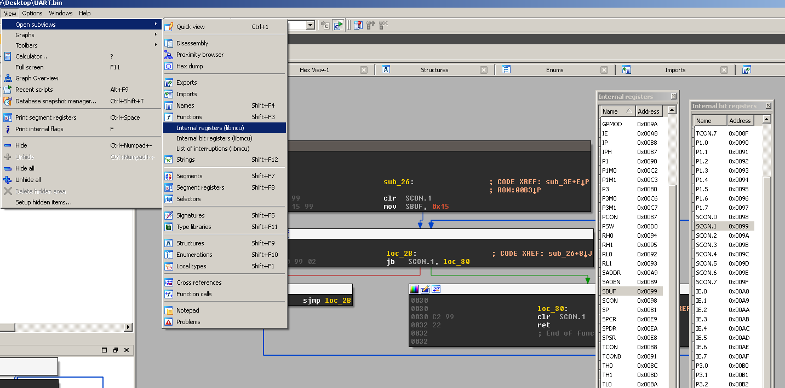

##### udasm

Tiny disassembler  for microcontrollers  with configurable  memory map.  Most of
existing disassemblers for microcontrollers are either a part of binutils or IDA
processor modules  with a static  memory map. In  other words, you  usually have
either  to recompile  the  processor module  or use  a  third-party script  that
handles internal registers. Thanks to libconfig,  with udasm you can easly write
your own memory map with a single configuration file and without recompiling the
whole shit.

##### libmcu

There is currently no documentation.

##### Supported architectures

- Intel 8051
- ATMEL AVR 8(16)-bit

##### Supported file format

- Binary

##### memory map configuration

Check out cfg directory, im too lazy to explain this shit.

##### Bonus

Processor modules for IDA.
- Intel 8051

TODO:
[x] Add listview with all internal registers.
[-] Add xref for each internal register.

